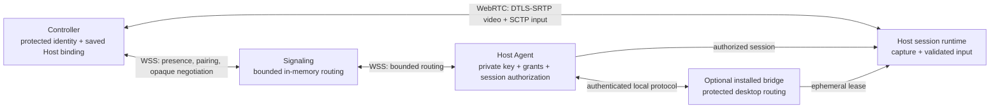

<!-- SPDX-License-Identifier: Apache-2.0 -->

# Architecture guide

**English** · [简体中文](README.zh-CN.md)

These documents define Roammand's device trust, transport, session, and platform boundaries. Start with the protocol and pairing model, then choose the platform or runtime path relevant to your work.

## System at a glance

- Devices, not the signaling service, are the trust authority. Pairing creates
  a one-way Controller-to-Host grant that remains on the Host until revoked.
- Signaling participates in discovery and routing but does not terminate media,
  hold long-term private keys, or approve control.
- Screen and input use the authenticated peer connection. STUN assists direct
  ICE discovery; the public profile does not provide a TURN relay.
- The current Host accepts one inbound Controller session. Mobile control is
  foreground-only, and protected-desktop behavior requires the installed bridge
  plus target-system acceptance.

## Core trust and transport

- [Protocol V1](protocol-v1.md) — Protobuf compatibility, authorization direction, limits, and validation.
- [Account-free pairing V1](account-free-pairing-v1.md) — live-QR pairing with Host approval, desktop-code pairing with four-word verification, and permanent Controller-to-Host grants.
- [Signaling V1](signaling-v1.md) — bounded WebSocket routing for presence, pairing, and opaque session negotiation.

## Desktop and mobile sessions

- [Desktop identity and local IPC V1](desktop-identity-ipc-v1.md) — protected Host identity and authenticated current-user communication between Flutter and the Host Agent.
- [Desktop WebRTC V1](desktop-webrtc-v1.md) — authenticated video, input data channels, ICE/TURN, and resource cleanup.
- [Mobile Controller V1](mobile-controller-v1.md) — iOS and Android identity, gestures, session launch, and lifecycle behavior.
- [Authenticated reconnect V1](reconnect-v1.md) — bounded recovery with fresh authentication and fail-closed input handling.

## Protected graphical sessions

- [Privileged session bridge V1](privileged-session-bridge-v1.md) — Host, broker, and graphical-session Helper roles across lock, login, and protected desktops.

For deployment commands, see [Building Roammand from source](../BUILDING.md).
Security assumptions, metadata exposure, and threat-specific analysis are
collected in the [security guide](../security/README.md).
