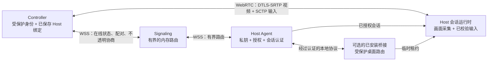

<!-- SPDX-License-Identifier: Apache-2.0 -->

# 架构指南

[English](README.md) · **简体中文**

这些文档定义 Roammand 的设备信任、传输、会话和平台边界。建议先阅读协议与配对模型，再根据需要查看对应平台或运行链路。

## 系统一览

- 信任权威是设备，而不是 signaling 服务。配对创建单向的 Controller → Host
  授权，并一直保存在 Host 上，直至本机撤销。
- signaling 参与发现与路由，但不终止媒体、不持有长期私钥，也不能批准控制。
- 画面与输入通过经过认证的 peer connection 传输。STUN 用于辅助 ICE 直连；
  公开配置不提供 TURN 中继。
- 当前 Host 同时只接受一个传入 Controller 会话。移动控制仅在前台运行；受保护
  桌面能力需要已安装桥接，并通过目标系统验收。

## 核心信任与传输

- [Protocol V1](protocol-v1.md) — Protobuf 兼容性、授权方向、大小限制和校验规则。
- [无账号配对 V1](account-free-pairing-v1.md) — 实时二维码加 Host 批准、桌面配对码加四词验证，以及永久 Controller → Host 授权。
- [Signaling V1](signaling-v1.md) — 用于在线状态、配对和不透明会话协商的有界 WebSocket 路由。

## 桌面与移动会话

- [桌面身份与本地 IPC V1](desktop-identity-ipc-v1.md) — 受保护的 Host 身份，以及 Flutter 与 Host Agent 之间经过认证的当前用户通信。
- [桌面 WebRTC V1](desktop-webrtc-v1.md) — 经过认证的视频、输入数据通道、ICE/TURN 和资源清理。
- [移动 Controller V1](mobile-controller-v1.md) — iOS 与 Android 身份、手势、会话启动和生命周期行为。
- [认证恢复 V1](reconnect-v1.md) — 使用全新认证、限制重试时间并在失败时关闭输入的恢复流程。

## 受保护图形会话

- [特权会话桥接 V1](privileged-session-bridge-v1.md) — Host、Broker 和图形会话 Helper 在锁屏、登录和受保护桌面之间的职责。

部署命令见[从源码构建 Roammand](../BUILDING.zh-CN.md)。安全假设、元数据暴露和
具体威胁分析见[安全指南](../security/README.zh-CN.md)。
