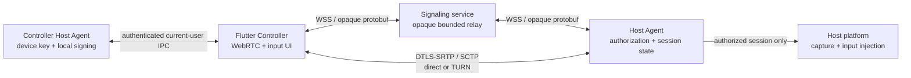

<!-- SPDX-License-Identifier: Apache-2.0 -->

# Desktop WebRTC V1

This document defines authenticated desktop WebRTC sessions for Windows and macOS. It complements [Protocol V1](protocol-v1.md), [Signaling V1](signaling-v1.md), and [Desktop identity and local IPC V1](desktop-identity-ipc-v1.md).

## Scope

Desktop WebRTC V1 provides one Controller-to-Host session with:

- the Host's main display as a one-way video track;
- H.264 as the first codec preference and VP8 as fallback;
- an ordered reliable input data channel;
- a low-latency, unordered pointer data channel;
- direct ICE with optional TURN relay;
- signed offer and answer authentication bound to device identities, SDP hashes, DTLS fingerprints, permissions, time, session ID, and nonce;
- deterministic resource and pressed-input cleanup.

It does not define pairing UI, account infrastructure, audio, clipboard, file transfer, multi-display selection, installers, background services, or mobile control.

## Components and trust boundaries

The device private key and persistent grants never leave the local Agent. Flutter receives only public identity data and narrowly scoped signatures over validated canonical transcripts. The signaling service sees routing identifiers and bounded opaque envelopes; it cannot mint a grant or a valid device signature. TURN relays encrypted WebRTC traffic and is not an authorization authority.

## Pre-authorized source runs

Controller-to-Host trust is permanent and one-way until the Host revokes it. Production grants come from pairing; controlled source-build tests may provision the same grant through an explicit maintenance operation:

1. The Controller asks its same-user local Agent for its public device identity.
2. The Controller exports a strict JSON descriptor containing version, signaling endpoint, device ID, Ed25519 public key, display name, and desktop platform.
3. The Host imports that descriptor through authenticated same-user local IPC and creates a view-and-control grant.
4. The reverse direction remains unauthorized unless the same process is separately repeated with the device roles reversed.

The descriptor contains no private key, bearer token, grant secret, or IPC authentication material. Unknown fields, unknown versions, disallowed plaintext WebSocket endpoints, identity derivation mismatches, and invalid desktop platforms are rejected. The only non-loopback plaintext exception is an explicitly enabled source Debug build using a literal private-network address.

QR and desktop-code pairing retain their two-minute rendezvous lifetime and Host-local confirmation requirements. Maintenance provisioning does not weaken or replace that flow.

## Authenticated session flow

Only one inbound remote session is admitted by a Host at a time.

1. Flutter creates a peer connection, a video receive transceiver, and exactly two Controller-created data channels.
2. Flutter creates an SDP offer and obtains its SHA-256 DTLS certificate fingerprint.
3. Flutter builds a `SessionOfferAuthentication` with Controller and Host IDs, a 16-byte session ID, a fresh 32-byte nonce, a validity window no longer than 30 seconds, requested permissions, the SDP SHA-256, and the Controller DTLS fingerprint.
4. The Controller Agent validates and signs Canonical Transcript V1 over those fields. Ordinary Protobuf serialization is never used as the signature transcript.
5. Signaling forwards the signed authentication and SDP as an opaque session envelope.
6. Before creating a Host peer connection, the Host validates fixed lengths, time window, nonce replay, target Host, permanent Controller grant, permissions, SDP hash, DTLS fingerprint, canonical transcript, and Ed25519 signature.
7. The Host starts capture and peer negotiation only after all offer checks pass.
8. The Host answer repeats the offer bindings and adds the answer SDP hash and Host DTLS fingerprint. The Host Agent signs the canonical answer transcript.
9. Flutter verifies the expected Host identity, complete offer binding, validity window, hashes, fingerprint, and Host signature before accepting the answer or releasing buffered remote ICE candidates.

An invalid, expired, unauthorized, replayed, mismatched, or incorrectly signed message fails before remote input becomes available. ICE candidates are bounded while authentication or negotiation is pending.

## Media and ICE

The Host captures the operating system's main display at an approximately 30 fps source cadence. The capture source excludes the local cursor; the Controller draws its own interaction position. The current vertical slice does not switch displays or renegotiate resolution after a display change.

Video codec preference is:

1. H.264
2. VP8

The actual selected codec is the first mutually supported codec. DTLS-SRTP protects media and SCTP data channels end to end between peers.

ICE policy defaults to `all`. The release profile configures public STUN URLs
to gather server-reflexive candidates and does not provide a TURN fallback.
The lower-level developer configuration can add relay candidates; TURN URL,
username, and password must be supplied together, are bounded, and must be
configured consistently on the Host Agent and Controller app. Credentials must
be short-lived where the TURN deployment supports it and are never printed by
the smoke tooling.

## Data channels

The negotiated application contract contains exactly these channels:

| Label | Reliability | Purpose |
| --- | --- | --- |
| `input.reliable` | ordered, reliable | keyboard transitions, pointer buttons, scroll, release-all, and session control |
| `pointer.fast` | unordered, `maxRetransmits = 0` | coalesced absolute pointer movement and low-latency pointer events |

Both channels carry size-bounded Protobuf envelopes with the active session ID and monotonically increasing sequence values.

The reliable channel requires the next exact sequence and tracks pressed keys/buttons. Duplicate down transitions, invalid usage values, wrong session IDs, out-of-range coordinates, illegal enum/state combinations, and permission violations are rejected. The fast channel accepts only a newer sequence; stale movement is dropped without blocking reliable input. Controller pointer movement is coalesced to at most 60 updates per second and respects data-channel backpressure.

Coordinates use normalized unsigned values across the displayed video rectangle. Flutter's `BoxFit.contain` letterboxing is excluded before mapping, so input outside the visible video is not sent.

## Lifecycle and cleanup

Close is idempotent on both peers. Every close path attempts all cleanup even when one operation fails:

- release all pressed keys and pointer buttons;
- stop accepting data-channel input;
- close both data channels and the peer connection;
- stop display capture and renderer resources;
- clear pending ICE and session state;
- return the Host to idle.

Cleanup runs on normal exit, local `Ctrl+Alt+Shift+Esc`, Flutter pause/dispose, signaling loss, Host revocation, authentication or peer failure, and input injection failure. Focus loss releases pressed input without automatically ending an otherwise healthy session.

Revoking a Controller grant first persists the revocation, then terminates matching active sessions. A second Controller receives a busy error while the first session owns the Host.

## Platform requirements

### macOS Host

The Host process requires Screen Recording permission for capture and Accessibility permission for input injection. Permission denial or a missing main-display source fails the session closed. The local Flutter app and Host Agent must run under the same user for authenticated IPC.

### Windows Host

The Host must run in the interactive user's desktop session. Windows input injection is subject to operating-system integrity boundaries, so a normally launched Host cannot control a higher-integrity elevated application. Identity protection uses the current user's DPAPI context.

## Configuration

The Host Agent reads:

| Variable | Meaning |
| --- | --- |
| `ROAMMAND_SIGNALING_ENDPOINT` | `wss://` signaling endpoint, loopback `ws://`, or an explicitly enabled private-address `ws://` in source Debug builds |
| `ROAMMAND_ALLOW_INSECURE_LAN_SIGNALING` | exact value `true` opts a Debug Host Agent into private-address plaintext WS; ignored outside builds with debug assertions |
| `ROAMMAND_ICE_TRANSPORT_POLICY` | `all` (default) or `relay` |
| `ROAMMAND_STUN_URLS` | comma-separated `stun:` or `stuns:` URLs; no credentials |
| `ROAMMAND_TURN_URLS` | comma-separated `turn:` or `turns:` URLs |
| `ROAMMAND_TURN_USERNAME` | TURN username; required with URLs |
| `ROAMMAND_TURN_PASSWORD` | TURN password; required with URLs |

The Flutter Controller reads the same STUN and optional developer TURN
variables. Its signaling endpoint comes from the validated Host descriptor. A
Flutter Debug Controller must receive the matching
`--dart-define=ROAMMAND_ALLOW_INSECURE_LAN_SIGNALING=true` before it accepts a
private-address plaintext binding. Profile and Release always retain the
production endpoint policy. STUN rejects credentials; partial TURN
configuration or relay-only mode without TURN fails at startup rather than
silently falling back.

## Verification

Run `make test-m4` for the automated vertical-slice gate. It covers signed negotiation state machines, native Host peer construction on supported build hosts, exact channel contracts, signaling reconnect/routing, input cleanup, ten connect/close cycles, strict optional configuration parsing, and a desktop Debug build.

Automated tests validate the protocol and lifecycle contracts. Real capture, operating-system input injection, NAT traversal, and TURN operation require target-device validation through the [desktop session matrix](../testing/desktop-session.md).
